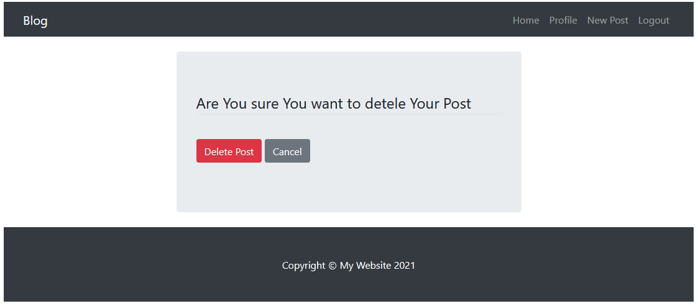

# Simple_blog_project

## Project Description

The project idea was to create a basic blog project with user
registration, login, logout, user profile and create post, update post and delete post 

## Python version: 3.9+

## Instructions to run the script

1. Goto the directory where you want to store your project.
2. Clone the git repository to the project directory.
3. Open the terminal and navigate to the project directory from the terminal.
4. Create virtual environment from the terminal by typing ```virtualenv venv``` and activate it by typing `source venv/bin/activate`(for Linux), `venv/Scripts/activate`(for Windows).
    * If you don't have `virtualenv` installed then install it by typing `pip install virtualenv`.
5. Install the project dependencies by typing `pip install -r requirements.txt` on the terminal.
7. Migrate the database by typing `python manage.py makemigrations` and then `python manage.py migrate` on the terminal.
8. Create admin user if you want by typing `python manage.py createsuperuser` and give the required credentials on the terminal.
9. Now, Run the project from your **localhost** by typing `python manage.py runserver`
10. Navigate to the URL [127.0.0.1:8000](127.0.0.1:8000) or [localhost:8000](localhost:8000) from your browser.
11. You can terminate the server anytime by **CTRL+c**.

### URL's I've implemented:
* index/
* post_lists/{username}/
* post_detail/{pk}/
* post_create/NEW/
* post_update/{pk}/
* post_delete/{pk}/
* register/
* profile/
* update_profile/
* login/
* logout/

## Snapshots:

* **index/**

* **post_lists/john/**

* **login/**

* **register/**

* **profile/**

* **update_profile/**

* **post_create/NEW/**

* **post_update/1/**

* **post_delete/1/**

* **logout/**

